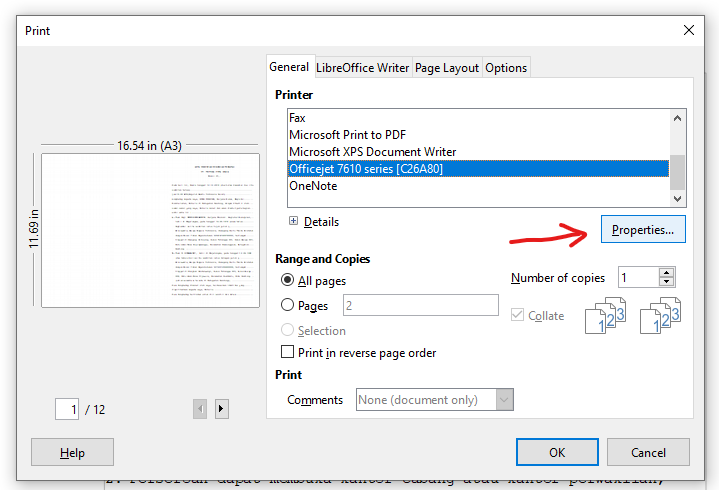

# Print Setting

Printer yang digunakan untuk konfigurasi ini adalah HP Officejet 7612.

## Libreoffice

### Setting Print akta pada lembar A3

1. Klik menu file dan pilih print atau Ctrl+P.
2. Pada Tab _General_, Pilih printer Officejet 7610 series pada kolom Printer.
3. Pilih menu **Properties...**.
   
4. Klik Tab _Paper/Quality_, ubah settingan seperti gambar dibawah ini :
   
5. Klik Tab _Layout_, ubah settingan seperti gambar dibawah ini :
   
6. Klik **Ok** .
7. Pilih Tab _Page Layout_, ubah settingan seperti gambar dibawah ini :
   
8. Klik **Ok**.
